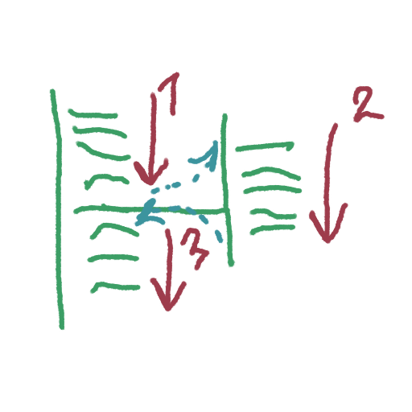
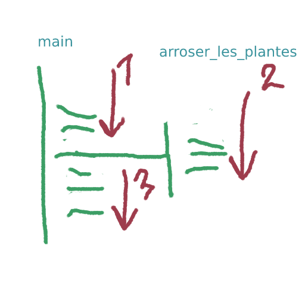

# Niveau 1 - Déclaration et appel
---
*Pré-requis :*
- [Variables et types de données - Niveau 1](../datatypes/COURS_variables_lvl_1.md)
- [Structures de contrôle - Niveau 1](../structures_controle/COURS_structures_controle_lvl_1.md)

# Sommaire
<!-- toc -->

---
Les fonctions sont des éléments primordiaux de la plupart des [langages de programmation](../definitions/langages_de_programmation.md), elles structurent le code quand elles sont bien gérées, le rendent modulable et surtout compréhensible et lisible.

*A quoi sert-elle et comment elle marche ?*\
Pour répondre à cette question on va séparer les concepts de la syntaxe.\
Les fonctions sont comme des **recettes de cuisine**, on commence une recette, on fait les étapes, puis on a un résultat comestible, on espère.\
Une autre jolie image c'est que les fonctions sont comme de **multiples chefs d'orchestres avec chacun leur partition à suivre**. Quand un chef d'orchestre est appelé, il joue sa pièce de musique, puis quand il a fini, il s'arrête.\ 
Dans tout les cas, essayez de créer votre propre analogie ou compréhension une fois que vous aurez appris son comportement.

> Une fonction peut être **appelée**, et elle peut **retourner** un résultat.



Si vous avez mis en place votre environnement de code avec [Préparer l'environnement](/intro/GUIDE_setup.md), vous avez déjà vu comment exécuter la fonction **main**.

Quand on exécute la commande `gcc` on **appelle** la fonction `main` qui **retourne** 0.\
Souvenez-vous que 0 en C signifie **Vrai**, ou **True** (voir [La logique informatique](../definitions/logique_informatique.md))
C'est juste pour s'assurer que la fonction s'est correctement exécutée sans erreur.

Puisqu'on en a déjà manipulé sans s'en rendre compte, créons-en d'autres et apprenons leur comportement !\
Pour la suite des consignes souvenez-vous aussi que l'exécution est séquentielle, ligne par ligne. Ca deviendra important.
## Déclaration de ~~revenus~~ fonctions
Souvenez-vous de la structure de la fonction **main** et servons-nous en pour construire la fonction `arroser_les_plantes`:
``` c
int arroser_les_plantes() {
	return 0;
}
```
Cette fonction marche parfaitement ! Elle ne fait rien de spécial, puisque si on l'appelle, elle renvoie 0, c'est à dire "aucun problème".

On appelle la façon d'écrire une fonction sa **signature**.\
Notre fonction à :
- Un **type de retour**, ici, *int*
- Un **nom**, ici *arroser_les_plantes*
- Des **paramètres**, ici les parenthèses vides, c'est à dire aucun paramètre. Pour l'instant on ne s'y attarde pas.

> [!IMPORTANT]
> Vous avez remarqué les accolades ? Souvenez vous ! C'est le **corps** de la fonction, le **bloc**, sa **portée.**

## Appel d'une fonction
Maintenant qu'on a déclaré une fonction, on va l'implémenter dans le code et l'appeler depuis la fonction **main**.

```c
int arroser_les_plantes() {
	return 0;
}

int main() {
	arroser_les_plantes();
    return 0;
}
```
On peut déjà relever plusieurs choses :
- La fonction **arroser_les_plantes** est déclarée **en dehors du corps de la fonction main**. Rappelez vous des blocs et de la portée du code.
- Cette nouvelle fonction retourne 0, comme la fonction main, pour nous dire que tout s'est bien déroulé.
- On **appelle** la fonction **arroser_les_plantes** depuis la fonction main, avec une syntaxe très courante : `nom_de_la_fonction()`. Ces parenthèses sont souvent la clé pour deviner si on appelle une fonction ! On verra plus tard que ces parenthèses sont synonymes de **paramètres** d'une fonction.

> [!IMPORTANT]
> Parfois, les appels de fonctions ont une syntaxe différente, rappelez-vous bien de séparer concept et syntaxe !

## Exécution
Que va-t-il se passer lors de l'exécution ? On demande à la fonction ce qu'elle veut pour son dernier repas avant de passer à la chaise électrique ? Ca aurait été beaucoup plus fun comme explication, malheureusement c'est totalement hors sujet et on est partie en roue libre.

On se concentre, pensons positif, pensons **recette de cuisine**. Là, il va falloir s'accrocher un peu mais faites moi confiance. Inspire, expire, inspire, inspire, inspire ...\
J'ai déjà dit plusieurs fois que l'exécution est séquentielle, est c'est toujours vrai, mais cette fois-ci il va falloir discerner **déclaration** (ou **définition**, **initialisation**) d'une fonction et **appel** d'une fonction. Pas de panique en réalité, on l'a déjà vu avec les variables, et c'est plutôt intuitif avec les bons exemples.

Replongeons dans les profondeurs du code précédent :
```c
int arroser_les_plantes() {
	return 0;
}
```
Ici, ma fonction est **définie**, c'est à dire que j'ai modelé sa forme, sa structure.\
Pour imager, ces lignes signifient "je créée la recette **arroser_les_plantes**, elle existe, et fera ça et ça, puis retournera 0" mais à **aucun moment** on ne l'appelle !\
Certes, arroser les plantes est un nom de recette étrange, mais c'est comme faire à manger pour les plantes :)\
Si on omet la ligne `arroser_les_plantes()` dans la fonction main, elle ne sera jamais appelée, mais elle existera.\
C'est bon, expire.



## Conclusion
La fonction est d'abord définie, puis elle peut être appelée ou non ! Définie, c'est juste qu'elle existe.\
**On ne pourra en revanche jamais appeler une fonction non définie !**\
Maintenant que vous connaissez les fonctions, on peut en faire partout. Si vous souhaitez rendre votre code modulable, ou bien le segmenter, rien ne vous empêche de prendre des opérations et les placer dans une fonction annexe pour clarifier les choses.

C'est plus simple de lire la fonction `main` suivante, si on imagine que chaque fonctions qu'on a créé englobe des dizaines de lignes d'opérations ! 
```c
int main() {
	afficher_bienvenue();
	char lettre = generer_lettre_aleatoire();
	char nombre = generer_nombre_aleatoire();
	afficher_au_revoir();
}
```

## [Exercices !](EXERCICE_fonctions_lvl_1.md)