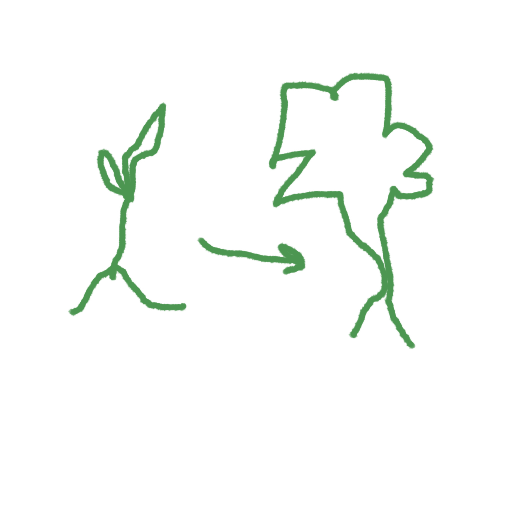

# Introduction
---
Bienvenue :) Ce cours va vous servir à découvrir et développer des **fondations** en programmation informatique !\
Le but est de vous apprendre les bases, et d'amener doucement l'abstraction et les raccourcis ensuite. Aucun langage spécifique n'est traité, même si une forte ressemblance au C dans les concepts et les détails peut se faire ressentir.

Chaque section est composée de **Niveaux**. Certaines sections seront plus copieuses que d'autres, mais ne vous laissez pas avoir. Parfois, il faut plusieurs paragraphes et quelques images pour transmettre une idée qui semble simple, et à l'inverse une seule phrase peut résonner avec vous pour assimiler un concept très abstrait.\
A chaque fin de Niveau, une partie Exercice vous attends avec des réponses rédigées pour mieux comprendre les syntaxes, concepts, etc...

> [!IMPORTANT]
> N'oubliez pas qu'au début, c'est normal d'être perdu dans les explications et de se tromper **tout le temps**. C'est pareil pour tout le monde au début et même plus tard !

Tout au long du parcours, il est fortement conseillé de vous former sur plusieurs axes :
- [Apprendre à chercher](intro/GUIDE_apprendre_a_chercher.md) les informations, le plus tôt possible, pour devenir autonome et performant
- Apprendre l'anglais pour débloquer de nouvelles ressources et partager vos idées dans une communauté mondiale. Savoir également chercher en anglais est un outil très puissant. Bien que ce cours restera en français pour des soucis d'accessibilité, l'anglais est requis pour atteindre certains niveaux en informatique, et dans la vie !
- Rester curieux et humble

Pour toute question ou feedback sur ce projet, n'hésitez pas à me contacter sur leoleocharreau@gmail.com
# Plan du cours
---
 Bien que le cours soit fragmenté sans réelle structure, il est recommandé de suivre l'ordre suivant, et de compléter tous les Niveaux 1. Libre à vous d'apprendre autrement !
 - [Programmation informatique](COURS_programmation.md)
 - [Préparer l'environnement de code](GUIDE_setup.md)
 - [Apprendre à chercher](GUIDE_apprendre_a_chercher.md)
 - [Les variables et les types de données - Niveau 1](../datatypes/COURS_variables_lvl_1.md)
 - [Les opérateurs - Niveau 1](../operateurs/COURS_operateurs_lvl_1.md)
 - [Les fonctions - Niveau 1](../fonctions/COURS_fonctions_lvl_1.md)
 - [Les opérateurs - Niveau 2](../operateurs/COURS_operateurs_lvl_2.md)
 - [Les structures de contrôle - Niveau 1](../fonctions/COURS_structures_controle_lvl_1.md)
 