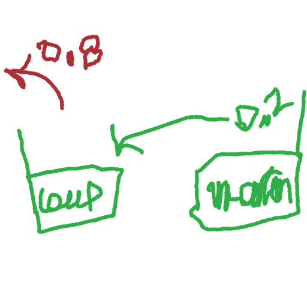

# Niveau 1 - Opérateurs de base
---
*Pré-requis :* [Variables et types de données - Niveau 1](../datatypes/COURS_variables_lvl_1.md)

# Sommaire
<!-- toc -->

## Opérateur `=`
Calculer c'est bien. Mais sans stocker la valeur, on ne peut pas faire grand chose !\
Souvenez-vous que l'ordinateur **remplace à l'exécution les variables par leurs valeurs**.

Nous avons déjà vu dans le cours des **variables** certaines notions, normalement le code suivant est acquis :
```c
int poulailler;
poulailler = 2;
```

Alors allons plus loin. Pouvez-vous deviner la valeur de `loup` à la fin de l'exécution ?
```c
float loup = 0.8; // On initialise / déclare et affecte une valeur en même temps
float mouton = 0.2;

loup = mouton;
```



Que s'est-il passé ? On a écrasé la valeur de la variable `loup` par la valeur de la variable `mouton`.\
Donc `loup` vaut 0.2 et `mouton` aussi !

En python, on omet les types, mais le principe et les résultats sont les mêmes
```python
loup = 0.8
mouton = 0.2
loup = mouton
```

## Opérateurs `+`, `-`, `/`, `*`, `%`
Ces opérateurs sont les mêmes qu'en mathématiques, avec addition, soustraction, division, multiplication et modulo respectivement.

Voyons comment ils fonctionnent :
``` c
int cagette = 1;
int pissenlit = 2;
cagette = (pissenlit + cagette) / 2;
```
Un peu complexe, mais on fait un calcul de maths. Souvenez-vous l'ordinateur **remplace** les variables.\
Ici, `pissenlit` vaut 2 et `cagette` vaut 1, du point de vue de l'ordinateur, la dernière ligne lui demande :
`mets dans la variable cagette la valeur (2 + 1) / 2`
## [Exercices !](EXERCICE_operateurs_lvl_1.md)