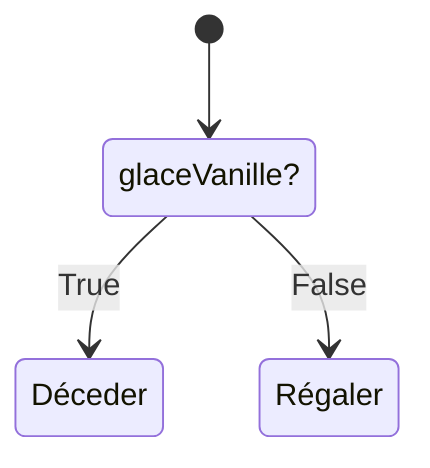

# Les structures de contrôle
---
*Pré-requis :*
- [Variables et types de données - Niveau 1](../datatypes/COURS_variables_lvl_1.md)
- [La logique informatique](../definitions/logique_informatique.md)
- [Opérateurs - Niveau 2](../operateurs/COURS_operateurs_lvl_2.md)

L'exécution d'un programme est **séquentielle**, comme une recette de cuisine.\
Les structures de contrôle vont changer l'ordre d'exécution avec des conditions et des règles, dans des blocs.\
En réalité c'est intuitif, on l'emploie même dans le langage courant : "si tu laisses ta glace par terre, les fourmis vont se régaler". C'est une condition, il y a deux possibilités. On laisse la glace, ou on ne la laisse pas !\
Et souvenez vous, une condition doit être `True` ou `False` ! Si c'est vrai, alors on fait X. Sinon (c'est à dire que c'est faux) on fait Y.

## Structures de contrôle
On va parler très rapidement de la **portée** du code et des **blocs**.\
L'informatique est un peu psychorigide et il faut respecter les différentes syntaxes.\
Très souvent, le code est aligné, indenté, et inclus dans des **blocs**

>Pour faire simple, une variable n'existe que dans le bloc où elle a été initialisée, et les instructions d'exécutions sont aussi délimitées par ce bloc.

Un exemple en C:
```c
int main() {
	float nbr_precis = 0.333333;

	return 0;
}
```
Notre magnifique fonction `main` !\
Le **corps** de la fonction est délimité par les accolades `{}`. Quand on sort de ces accolades, la variable `nbr_precis` n'existe plus. Si `return` était absent, l'exécution s'arrêterait à l'accolade fermante.

On va voir d'autres structures qui elles aussi ont des accolades, qui délimitent leurs champs d'action.\
N'oubliez pas que certains langages changent, en python on parle d'indentation :
```python
def main():
	float nbr_precis = 0.33333
```
Le code fonctionne car la ligne de la variable `nbr_precis` est indentée. Python interprète ça comme étant "dans le corps de la fonction `main`". On s'affranchit des accolades, mais on a une nouvelle règle à respecter. Le principe reste le même !

## Condition if / then / else
La structure "if / then / else" ou en français "si, alors, sinon", sert à poser des conditions logiques.\
Imaginons que votre programme vérifie si il y a une présence de polluant dans l'eau filtrée, il faut bien prendre une décision ensuite ! C'est bien joli d'afficher un message, mais on aimerait que l'ordinateur puisse exécuter des instructions qui alertent le responsable.

Prenons un exemple réaliste, imaginons cette fois-ci que je sois allergique à la vanille, mais que je décide quand même d'acheter une glace surprise.\
Si ma glace est à la vanille, alors je vais faire une réaction et mourir. Sinon, je vais me régaler.


On peut traduire ce comportement en code C:
```c
if (glace == "vanille") { // ici on demande 'la glace est à la vanille ?'
	// mourir
} else {
	// se régaler
}
```
Si glace est à la vanille, alors on exécute le code pour mourir, sinon on exécute le code pour se régaler !\
Voyons voir le même code en python:
```python
if glace == "vanille":
	# mourir
else:
	# se régaler
```
On remarque que le bloc **if / then / else**, tout comme le bloc de fonction est délimité différemment en C et en python. Peut importe ! On accepte les règles, et on essaie de comprendre le principe.