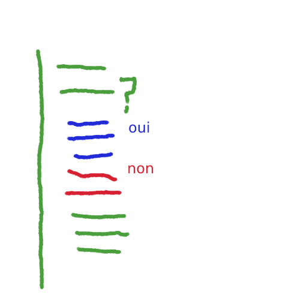

# Les structures de contrôle
---
*Pré-requis :*
- [Variables et types de données - Niveau 1](../datatypes/COURS_variables_lvl_1.md)
- [La logique informatique](../definitions/logique_informatique.md)
- [Opérateurs - Niveau 2](../operateurs/COURS_operateurs_lvl_2.md)

# Sommaire
<!-- toc -->


---
L'exécution d'un programme est **séquentielle**, comme une recette de cuisine.\
Les structures de contrôle vont changer l'ordre d'exécution avec des conditions et des règles, dans des blocs.\
En réalité c'est intuitif, on l'emploie même dans le langage courant : "si tu laisses ta glace par terre, les fourmis vont se régaler". C'est une condition qui est soit vraie, soit fausse. Il y a deux possibilités, si on laisse la glace alors les fourmis vont se régaler, sinon, elles ne se régaleront pas !

## Structures de contrôle
On va parler très rapidement de la **portée** du code et des **blocs**.\
L'informatique est un peu psychorigide et il faut respecter les différentes syntaxes.\
Très souvent, le code est aligné, indenté, et inclus dans des **blocs**

>Pour faire simple, une variable n'existe que dans le bloc où elle a été initialisée, et les instructions d'exécutions sont aussi délimitées par ce bloc.

Un exemple en C:
```c
int main() {
	float nbr_precis = 0.333333;

	return 0;
}
```
Notre magnifique fonction `main` !\
Le **corps** de la fonction est délimité par les accolades `{}`. Quand on sort de ces accolades, la variable `nbr_precis` n'existe plus. Si `return` était absent, l'exécution s'arrêterait à l'accolade fermante.

On va voir d'autres structures qui elles aussi ont des accolades, qui délimitent leurs champs d'action.\
N'oubliez pas que certains langages changent, en python on parle d'indentation :
```python
def main():
	float nbr_precis = 0.33333
```
Le code fonctionne car la ligne de la variable `nbr_precis` est indentée. Python interprète ça comme étant "dans le corps de la fonction `main`". On s'affranchit des accolades, mais on a une nouvelle règle à respecter. Le principe reste le même !

## Condition if / then / else
La structure "if / then / else" ou en français "si, alors, sinon", sert à poser des conditions logiques.\
Imaginons que votre programme vérifie si il y a une présence de polluant dans l'eau filtrée, il faut bien prendre une décision ensuite ! C'est bien joli d'afficher un message, mais on aimerait que l'ordinateur puisse exécuter des instructions qui alertent le responsable.

Prenons un exemple réaliste, imaginons cette fois-ci que je sois allergique à la vanille, mais que je décide quand même d'acheter une glace surprise.\
Si ma glace est à la vanille, alors je vais faire une réaction et mourir. Sinon, je vais me régaler.


On peut traduire ce comportement en code C:
```c
if (glace == "vanille") { // ici on demande 'la glace est à la vanille ?'
	// mourir
} else {
	// se régaler
}
```
Si glace est à la vanille, alors on exécute le code pour mourir, sinon on exécute le code pour se régaler !\
Voyons voir le même code en python:
```python
if glace == "vanille":
	# mourir
else:
	# se régaler
```
On remarque que le bloc **if / then / else**, tout comme le bloc de fonction est délimité différemment en C et en python.\
Peut importe, on accepte les règles, et on essaie de comprendre le principe.



## Boucles for / while
Les structures "for" et "while" sont des boucles qui vont **itérer**. Elles sont particulièrement utiles pour les tâches répétitives.\
Pour comprendre leurs différences et leur fonctionnement, on va prendre deux exemples.
### Boucle for
La boucle "for" (qui signifie en français "pour"), demande à l'ordinateur :
**Ordinateur, pour un nombre définit de répétition, fait ça.**\
Imaginons que nous voulons faire pousser des fleurs, plus précisément des [soucis](https://fr.wikipedia.org/wiki/Calendula), dans votre jardin. Votre poche a 12 graines de soucis, et vous voulez les planter en ligne, pour faire joli.\
A quoi ressemblerait la logique de la **recette** pour planter toutes ces plantes ?

En langage naturel, on peut dire qu'on se place au début de la ligne, on sort une graine de sa poche, on fait un trou dans la terre, on plante la graine, on recouvre de terre, et on arrose, puis **on vérifie qu'on peut toujours avancer d'un pas** et on recommence.\
Du 1er pas au 12eme pas, on fait des actions à chaque pas, c'est exactement le fonctionnement d'une boucle **for** !

Les syntaxes changent beaucoup selon les langages, mais souvenez vous des principes :
- Au début on fixe une valeur de départ, et une condition de fin. Dans notre cas on commence au pas 1 et on finis au 12eme pas. A chaque itération, l'ordinateur vérifiera si la variable `pas` sera plus petite que 12. Si c'est le cas, c'est qu'on est à la fin du jardin donc la boucle s'arrête.
- Enfin on choisit l'incrément ou décrément de la variable, à chaque fois que la boucle se termine, l'ordinateur va modifier la variable `pas`. Dans notre cas, on avance d'un pas à chaque fois alors on l'incrémente de 1.

En C, la syntaxe est la suivante :
```c
for (initialisation variable ; test condition ; mise a jour variable) {
	//code
}
```
Et ci-dessous notre exemple concret : 
```c
for (int i = 1; i < 12; i++) {
	planter_soucis();
}
```
Ici, la variable `i` représente les pas, par convention on appelle cette variable `i` dans les boucles.\
Le code dit que `i` commence à 1, et qu'à chaque itération, on vérifie que `i < 12`. Si c'est le cas, alors on fait l'opération `i++` et on exécute le code à l'intérieur du corps de la boucle. Sinon, on sort de la boucle.

### Boucle while
La boucle "while" (qui signifie en français "tant que"), demande à l'ordinateur :
**Ordinateur, tant que la condition n'est pas remplie, fait ça.**\
C'est différent de la boucle **for**, car là on ne définit pas explicitement de nombre de répétition, simplement le fait qu'on s'arrête quand la condition est remplie.\
Imaginons qu'on veuille faire pousser un citronnier, et qu'on veuille l'arroser tant qu'il n'a pas atteint 1 mètre 30.\
A quoi ressemblerait la logique de la **recette** pour le faire pousser ?

En langage naturel, on regarde la taille du citronnier, s'il n'est pas à 1 mètre 30, alors on l'arrose s'il en a besoin. Si en revanche il fait 1 mètre 30 ou plus, on ne l'arrose plus ! Tant pis pour lui.

En C, la syntaxe est la suivante :
```c
while (test condition) {
	//code
}
```
Et voila ci-dessous note exemple concret :
```c
while (taille_citronnier_cm < 130) {
	arroser_citronnier();
}
```

