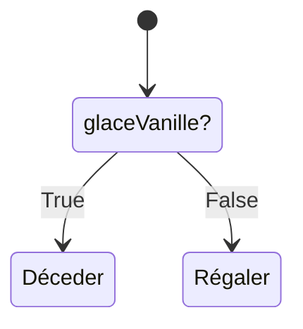
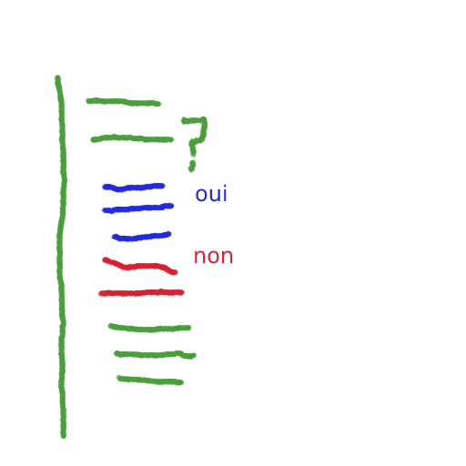

# Niveau 2 - Conditions if/then/else
---
*Pré-requis :*
- [Variables et types de données - Niveau 1](../datatypes/COURS_variables_lvl_1.md)
- [La logique informatique](../definitions/logique_informatique.md)
- [Opérateurs - Niveau 2](../operateurs/COURS_operateurs_lvl_2.md)

# Sommaire
<!-- toc -->

---
Les structures de contrôle de condition sont en réalité intuitifs, on l'emploie même dans le langage courant : "si tu laisses ta glace par terre, les fourmis vont se régaler". C'est une condition qui est soit vraie, soit fausse. Il y a deux possibilités, si on laisse la glace alors les fourmis vont se régaler, sinon, elles ne se régaleront pas !


## Avec des `if`, on refait le monde
La structure "if / then / else" ou en français "si, alors, sinon", sert à poser des conditions logiques.\
Imaginons que votre programme vérifie si il y a une présence de polluant dans l'eau filtrée, il faut bien prendre une décision ensuite ! C'est bien joli d'afficher un message, mais on aimerait que l'ordinateur puisse exécuter des instructions qui alertent le responsable.

Prenons un exemple réaliste, imaginons cette fois-ci que je sois allergique à la vanille, mais que je décide quand même d'acheter une glace surprise.\
Si ma glace est à la vanille, alors je vais faire une réaction et mourir. Sinon, je vais me régaler.


On peut traduire ce comportement en code C:
```c
if (glace == "vanille") { // ici on demande 'la glace est à la vanille ?'
	// mourir
} else {
	// se régaler
}
```
Si glace est à la vanille, alors on exécute le code pour mourir, sinon on exécute le code pour se régaler !\
Voyons voir le même code en python:
```python
if glace == "vanille":
	# mourir
else:
	# se régaler
```
On remarque que le bloc **if / then / else**, tout comme le bloc de fonction est délimité différemment en C et en python.\
Peut importe, on accepte les règles, et on essaie de comprendre le principe.



## [Exercices !](EXERCICE_structures_controle_lvl_2.md)